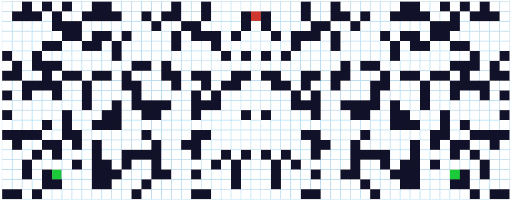

# AlgorithmVisualizer
React based tool for visualizing Pathfinding Algorithms. 

## Algorithms Implemented
* **BFS**

* **DFS**

* **Djikstra**

* **A star**

* **Greedy Best First Search**

## Features
* Implemented a unique "versus" feature which enables the user to visualize 2 algorithms at the same time and understand which finds the destination first.
* Has a maze feature, symmetric in nature to aid the above mentioned feature.

## Versus Feature
* **BFS vs DFS**

* **Djikstra vs A star**

* **Djikstra vs Greedy BFS**

* **A star vs Greedy BFS**

## Tech Stack
* React
* JavaScript
* CSS

## Tutorials and Reference links
* [Clement's Pathfinding Visualizer](https://clementmihailescu.github.io/Pathfinding-Visualizer/)
* [Clement's Tutorial for the same](https://www.youtube.com/watch?v=msttfIHHkak)
